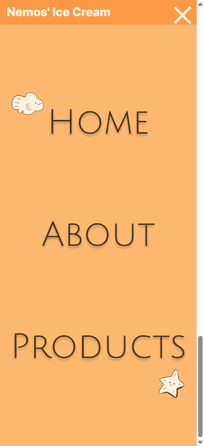
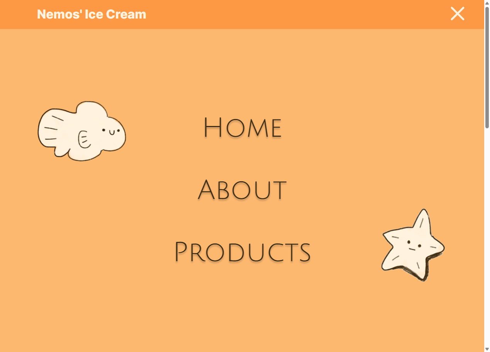
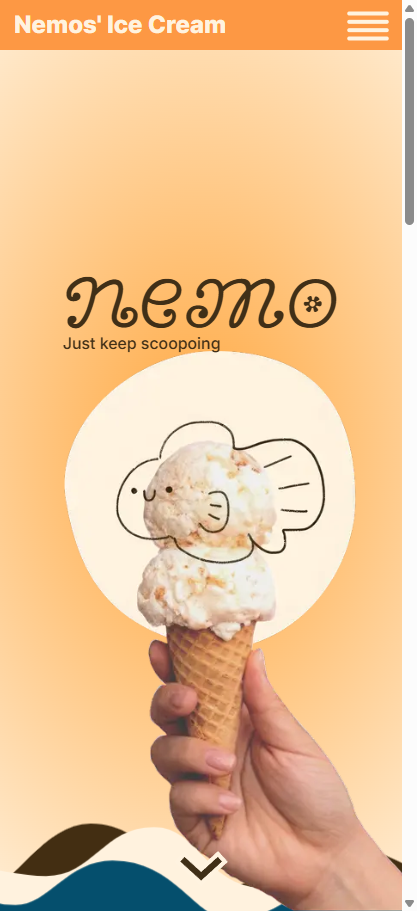
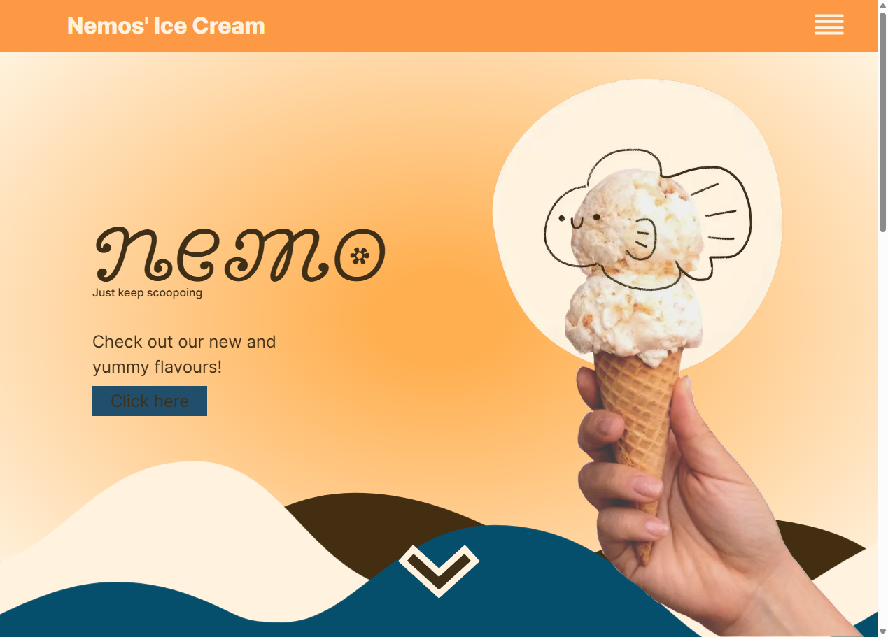
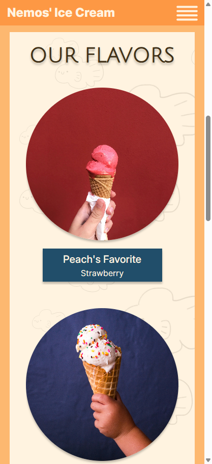
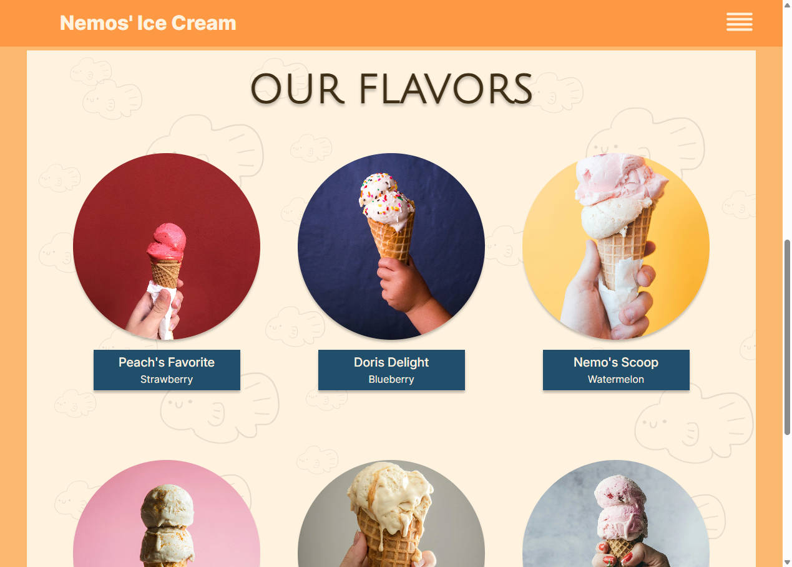
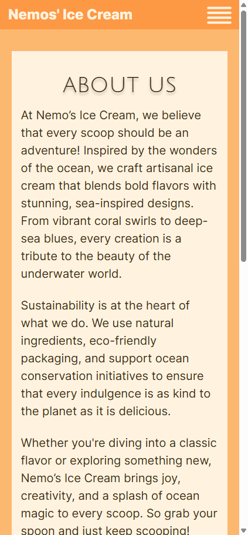
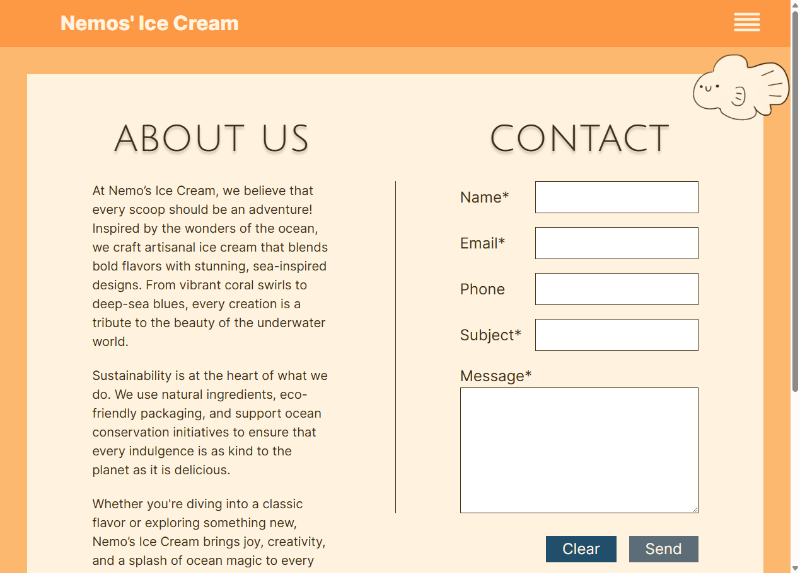

# nemos-glassbar

This template should help get you started developing with Vue 3 in Vite.

## Recommended IDE Setup

[VSCode](https://code.visualstudio.com/) + [Volar](https://marketplace.visualstudio.com/items?itemName=Vue.volar) (and disable Vetur).

## Customize configuration

See [Vite Configuration Reference](https://vite.dev/config/).

## Project Setup

```sh
pnpm install
```

### Compile and Hot-Reload for Development

```sh
pnpm dev
```

### Compile and Minify for Production

```sh
pnpm build
```

### Lint with [ESLint](https://eslint.org/)

```sh
pnpm lint
```


## Code Sprint

### Description
Nemo’s Ice Cream is a visually engaging and user-friendly single-page application designed to showcase a variety of delicious ice cream flavors. The site consists of two main pages (views) achievable via routing in vue:
- **Home** features a welcoming hero section with eye-catching visuals, followed by a product section displaying all available ice cream flavors. Between these sections, animated waves create a smooth visual flow, and as users scroll down, background fish give the effect of diving underwater.
- **About Us/Contact** includes an About Us section that shares the story behind Nemo’s Ice Cream. Inspired by the wonders of the ocean, the brand crafts artisanal ice cream with bold flavors and sea-inspired designs, from coral swirls to deep-sea blues. Sustainability is a key focus, using natural ingredients, eco-friendly packaging, and supporting ocean conservation. The page also features a contact form for inquiries or feedback.

For easy navigation, the site includes a responsive burger menu, allowing users to switch between sections seamlessly. A footer is present on all pages, featuring the Nemo’s Ice Cream logo and useful navigation links. Additionally, a cookie consent banner ensures compliance with privacy regulations while enhancing the user experience.

### Team members
[Egil Eskilsson](https://github.com/bluemountain3d)
 
[Jonatan Hellberg](https://github.com/JHellberg04)

[Ephraim Axelsson](https://github.com/EphraimAxelsson)

[Emelie Boss](https://github.com/EmelieSonjaBoss)

### Screenshots

<details>
<summary><strong>Menu</strong> <i>(2 images)</i></summary>

##### Mobile


##### Desktop


</details>


<details>
<summary><strong>Start page - Hero S/ctionstrong> <i>(> 2mages)</i></summary>

##### Mobile


##### Desktop

</details>

<details>
<summary><strong>Start page - Product Section</strong> <i>(2 images)</i></summary>

##### Mobile


##### Desktop

</details>


<details>
<summary><strong>About page</strong> <i>(2 images)</i></summary>

##### Mobile


##### Desktop

</details>


### Techstack


[](#)

[](#)


[](#)

[](#)


